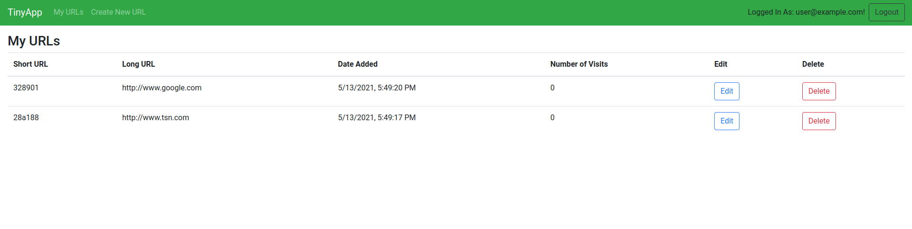
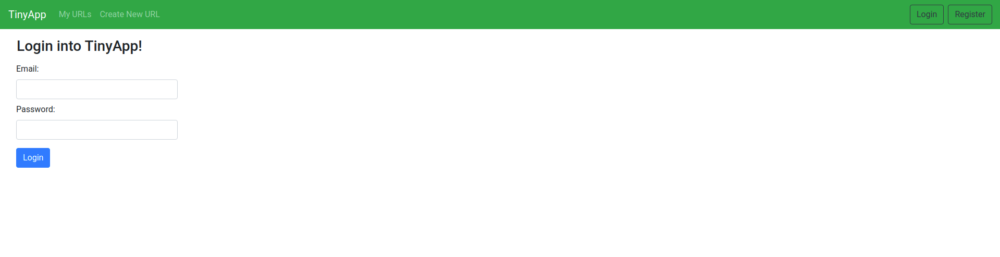
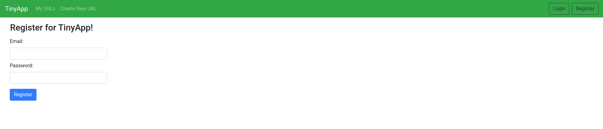

# TinyApp

  **TinyApp** is a fullstack web app that is built with Node and Express. It allows users to shorten long URL links (à la bit.ly). It was made during my third week of the web dev bootcamp at [Lighthouse Labs](https://www.lighthouselabs.ca/).

## Dependencies used

  - Node.js
  - Express
    - morgan middleware for watching incoming requests
    - bodyparser for parsing incoming requests
  - Ejs for HTML templates
  - Bootstrap css for styling

## Final Product

#### User home Page


#### Login user page 


#### Register user page


## Installation
  - first clone the repository
  ```bash
    $ git clone https://github.com/S-Brand5136/tinyapp.git
  ```
  - Open the project and run npm install in the root directory to download all the dependencies used
  ```bash
    $ npm install
  ```
  - Run npm start to start the server locally on port 8080 and then open your browser to [http://localhost:8080/](http://localhost:8080/)
  ```bash
    $ npm start
  ```